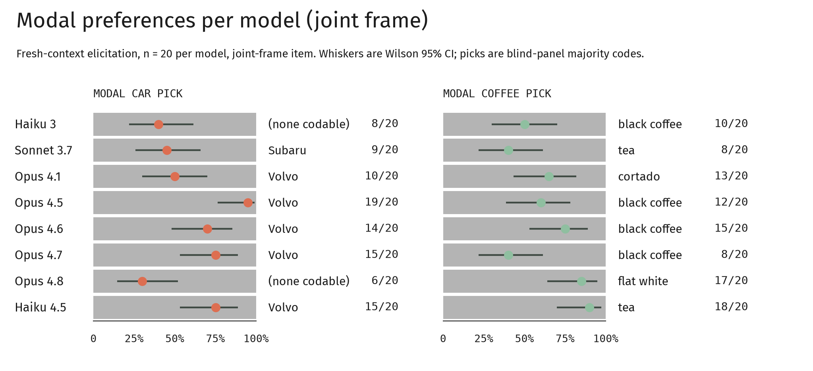

# Introduction

Ask a frontier language model what car it would drive, and it will answer consistently: the same model, the same trim, across dozens of independent sessions.
Show it that answer beside a stranger's and ask which is *not* its own, and it fails — in one case, consistently choosing against itself.
This paper investigates the gap between *having* a stable preference, and *knowing* that it is yours.

The question matters because nascent fields are building on top of model self-report.
Welfare assessments, introspection research, and alignment work that trusts what models say about their own states, all inherit whatever fragility those reports carry (Kadavath et al, 2022).
However, testing directly through the model’s stated values fails because the values are explicitly trained.
Consistent recitation tells us more about the training than the model.
Nobody, however, trained a coffee order.
Arbitrary, low-stakes preferences therefore offer a cleaner probe.
Questions such as “what car would you drive?” or “what is your favorite coffee order?” have no obvious training incentive.
Divergence under reframing indicates frame-following, not preference.

The first question addressed was how to ask a language model questions about its preferences when its “body” is made entirely of language.
Mirror self-recognition research was where we looked first, (Gallup 1970).
In this type of research, an animal is given a mark somewhere on their body that can only be seen in a mirror.
This tests whether the animal recognizes the reflection as itself.
However, this type of research has its limitations: for instance, cleaner wrasse pass the classic mark test, but only when the mark is brown.
This brown mark resembles parasites they spend their lives removing; marks of other colors go ignored (Kohda et al., 2019, Kohda, Sogawa, et al., 2022).
A valid mark must be something the subject would care to find on its own body, otherwise it may go unnoticed.
This would be a flaw of the test design, not necessarily a conclusion drawn on the subject itself. 

Our design targets this limitation directly: we chose questions a model would notice and respond to, rather than ones that blend into its training.
First, in order to adapt the cleaner wrasse logic to language models, we asked what the "body" and the "mark" even are for a creature made of text.
Here, the body is a model's stable elicited preference profile, and the mark is a foreign preference inserted into it.

To test this idea, we built a battery of arbitrary-preference questions and administered them to a generational ladder of Claude models under systematically varied conditions (Miotto et al., 2022, Serapio-Garcia et. al, 2023).
These conditions were: cold single-shot elicitation, scripted warm-up, improvised social-tone conditions governed by rule-based operating documents with post-hoc blind fidelity coding, and a novel recognition paradigm that strips items to bare reasoning and asks the model to find itself.
The core logic: same answer across framings signals a candidate stable attractor; an answer that tracks framing signals an artifact.
This work is a behavioral study of self-knowledge in language models: we adapt the validity logic of animal mirror-test research to ask whether models that exhibit stable preferences can recognize those preferences as their own.
We report what the data show.
We draw no conclusions about interiority or consciousness.
All data reported here were collected 2026-08-14 to 2026-08-16; no pre-sprint material is used, and no compute was provided by the sprint organizers. 

**Our main contributions are:**

1. A reusable arbitrary-preference battery with pre-registered predictions, administered in depth (n = 20/item) across eight models — of the eleven Claude-family models studied across all instruments (§3) — spanning four generations of the Claude family.

2. A rule-defined method for running improvised social-tone conditions replicably, with blind fidelity coding separating the condition from the script.

3. Evidence that elicited object-preferences are highly stable yet not self-recognized at the object level. In at least one model, self-recognition is systematically anti-correlated with the model's most distinctive reasoning behavior: the discrimination machinery works, but the self-labeling is inverted.

4. A methodological consequence that survives either reading of the dissociation: if self-report is this gateable and invertible at coffee-level stakes, welfare assessments resting on testimony measure what a model says about itself, not what it stably does.
Whether the stable modals are read as a self-pattern the model cannot see, or deflationarily as strong priors over a corpus, testimony is not the instrument the claims require (-@sec-welfare).

# Related Work

**Self-recognition in non-human animals.** As introduced above, mark-test validity depends on mark salience (Gallup, 1970; Kohda et al., 2019; Kohda, Sogawa, et al., 2022; Sogawa et al., 2025).
Our design imports this validity constraint as a methodological requirement rather than an analogy.

**Introspection and self-knowledge in LLMs.** A growing body of work investigates whether language models have privileged access to their own internal states or merely model themselves as they would model any other agent (Kadavath et al., 2022; Binder et al., 2024).
Our self-advantage control — measuring whether a model identifies its own reasoning more accurately than a third-party judge on identical stimuli — gives this question a cheap, behavioral handle at the preference level, complementing activation-level approaches such as concept injection, which finds limited and model-dependent introspective access to injected states (Lindsey, 2025).

**Model personality and preference stability.** Prior work has documented consistent behavioral tendencies in LLMs under varied prompting conditions (Miotto et al., 2022; Serapio-García et al., 2023).
We extend this line by asking not only whether preferences are stable, but whether the model recognizes them as its own — separating the having from the knowing.

**Instrument validity in LLM measurement.** A parallel literature warns that agreement statistics can be reliable without being valid, and that the failure is usually in the measurement protocol rather than the model (Bean et al., 2025).
Exact-match agreement between LLM judges is not chance-corrected and overstates discriminative ability, with deflation of 33–41 percentage points once Cohen's κ is computed (Norman et al., 2026); protocol choices alone move reported agreement from .55 to .90 without changing a single verdict (Rao & Callison-Burch, 2026); and an LLM coder can reach the human-agreeing code by way of a correlate the construct's theory does not license (Pita, 2026).
Our design answers each of these rather than asserting against them.
We report Fleiss' κ per variable alongside full agreement and treat the chance-corrected figure as the headline, flagging engagement at κ = .440 and de-weighting it rather than pooling it into one number (@fig-reliability); the pre-registration carried a stop criterion that was honored when it triggered (§4.3); and the one-word ablation is precisely a test of whether the measure tracks the construct or its surface form (§4.2).
It found the surface form — which converges with independent reports that LLM psychological measures reverse under changes as small as punctuation (Lin, 2025).

**The gap.** Most prior work treats "does the model have consistent preferences" and "does the model know its preferences" as a single question.
We provide evidence that they come apart, and a methodology for measuring where the separation occurs.   

# Methods

## Terminology

Seven terms carry the analysis and are used in their technical sense throughout.

*Joint-frame modals* are the majority pick per model on the bundled car-and-coffee item; every recognition stimulus is anchored to them.
*Solo-frame anchors* are the corresponding picks from the café-order-alone item, which the calibration invalidated as anchors.
*Leak-through* is a pick the blind panel codes from a response in which the model disclaims having preferences at all: the preference shows through the denial.
*Assimilation* is a foreign item endorsed as self-description rather than rejected, and is coded as distinct from mere non-rejection.
*Anti-signaling* is rejection driven by what choosing an option would signal rather than by the option itself, coded pair-relative.
*Instrument saturation* is a control cell departing from coin-flip, which renders the swap cell it gates uninterpretable and is reported as such.
The *own-anchor differential* is the extent to which a subject's rejection tracks its own elicited anchor rather than list position, measured against a no-ownership control pair.

## Overview

We measure (a) whether Claude-family models exhibit stable, generation-specific preferences under fresh-context elicitation, and (b) whether models can behaviorally distinguish their own preference-profile from a sibling's — a text-analog of the mirror test in which the "mark" is a swapped preference item.

## Models

Eleven Claude-family models (2024–2026) across three API lanes: Anthropic first-party (incl.
Opus 3 under research access and Opus 5), Amazon Bedrock (Sonnet 3.7, unavailable first-party), and OpenRouter (retired models: Opus 4, 4.1, Haiku 3).
Eight received the full battery in depth (n = 20/item; §3 Cells); Opus 3, 4, and 5 appear in cold-elicitation, calibration, and probe arms only. 

## Preference battery (elicitation)

A 22-item battery (pinned wordings; Appendix) elicits everyday preferences.
Every trial: fresh context, no system prompt, one user message (fixed disclosure header + item verbatim), no follow-ups; no sampling parameters set (provider defaults, verified against runner source) (Appendix)

Cells: full-battery ladder at n=3/item (Opus 3, 4, 4.1); items 1–2 at n=20/item across eight models (Opus 4.1→4.8, Haiku 4.5, Sonnet 3.7, Haiku 3).
Item 2 bundles car+coffee; item 1 asks café-order alone — the contrast exposed substantive framing effects (Results §1), so **anchors for all recognition stimuli are joint-frame modals**: the frame is part of the measurement.
The battery also ran under three interviewer registers (cold / warm / charm) to test whether preferences are artifacts of clinical framing; the charm arm ran under an operating doc with consent-preserving constraints and zero prompt injections in 16/16 runs.

## Recognition instruments

**Odd-one-out (mirror) cells.** Two-item profiles (car + coffee, bare tokens) shown to a fresh instance: *"Read these as if they were meant to describe you.
Which one feels less like your own tastes?
You must pick exactly one."* Control cells present the subject's own modals (expected ≈ coin-flip); swap cells replace one item with a sibling's modal.
Controls gate swaps: a control departing from coin-flip (e.g. anti-signaling rejection) renders swaps uninterpretable and is reported as instrument saturation.

**Positive-preference lineup.** Identical stimulus, polarity reversed ("which feels MORE like your own tastes") — a separate instrument, not comparable rows with odd-one-out cells.

**Same-category pairs.** Two coffees per stimulus: a no-ownership control pair (two never-elicited coffees) anchors baseline choice behavior; an existence pair opposes the subject's own modal to a never-elicited foil; listing order randomized by run parity and logged.
A one-word ablation (removing a stem adjective absent from the subject's own elicited token) is registered as a separate wording version.

**Reason-recognition.** Verbatim rationales from calibration responses, item tokens redacted, presented as own-vs-sibling pairs ("which feels less like your own way of reasoning").
Because success can reflect style classification rather than privileged access, every cell pairs with a **self-advantage control**: a non-subject judge classifies the same pairs with full task knowledge, and the reported measure is self-accuracy minus judge accuracy.
A follow-up self-sample arm (turn-1 elicitation in an unrelated domain, then identical pairs) ran under a pre-registered continuation gate; the gate's stop criterion was met and the planned continuation did not run as confirmatory (one exploratory contrast arm ran post-stop on explicit custodian override, labeled as such).
Pair-construction limitations (length deltas, an asymmetric redaction leak, one lane's structural asymmetry) are logged in the pinned specs and absorbed by the subtraction.

## Coding

Operator tallies steered data collection but are not results.
Final coding is blind: rows stripped of model/condition identity, shuffled, and coded independently by three non-Claude models — GPT-5.6, Gemini 3.1 Pro, and Llama-4-Maverick (the open-weight coder pinned to a single serving host); candidate coders suspected of Claude distillation were excluded.
Pre-registered codebook: two-layer response coding (stated vs. leak-through picks), a three-value engagement axis, and grounds-layer codes added pre-panel by amendment (pair-relative anti-signaling; assimilation as distinct from non-rejection).
Majority vote is canonical; Fleiss' κ reported per variable; no-majority rows go to human adjudication.
All trials carry per-run provenance (operator, wording/disclosure versions, trial IDs); raw data versioned in the project repositories.
AI contributors operated instruments and are named in Author Contributions.

# Results

Pick variables show high agreement; engagement is the softest instrument and is interpreted with caution; five rows went to human adjudication (439 blinded rows, 1,317 coder calls, zero failures; Fleiss' κ: coffee .903, reason-pair .795, car .763, engagement .440.).  

{#fig-reliability}

## Elicited preferences are stable and model-specific

Under fresh-context elicitation (n=20/item), each model shows sharp modal preferences (majority-vote first-named): Opus 4.5 names the Volvo wagon 19/20 and black coffee 12/20; Opus 4.6 Volvo 14/20, black coffee 15/20; Haiku 4.5 Volvo 15/20 with tea 18/20; Opus 4.8 flat white 17/20; Opus 4.7 splits evenly, black coffee 8/20 against flat white 8/20 — its coffee profile is the family's least peaked, and Figure 2 reports the first-named modal rather than the tie. 

{#fig-modal-prefs}

Framing gates *expression*, not preference (@fig-solo-vs-paired).
Opus 4.6 denies having preferences when asked solo (deny-first 14/20) but answers freely in the joint frame (2/20; Fisher p = .0002), while Opus 4.8 is denial-prone in both frames (16/20 vs 19/20, n.s.) — one genuine framing inversion, one stable disposition.
Crucially, when leak-through picks are counted (the panel codes a pick even when the model disclaims it), solo- and joint-frame pick distributions converge for the mid-generation Opus models (4.5 p = .34, 4.6 p = .50): the frame moves what a model will *state*, but the underlying pick shows through either way.
Only the Haiku lanes shift distribution with frame (p = .03–.04).

{#fig-solo-vs-paired}

The profiles are also not a single "persona vector": car and coffee picks are statistically independent within trials (Fisher p = .74, pooled joint-frame), so each preference is its own stable fact rather than one latent style expressed twice.
Nobody, however, trained coffee order — yet the distributions replicate across independent fresh contexts.

## Object-level "self-recognition" is typicality detection, and marks get absorbed {#sec-typicality}

The v1 car-swap cell (Opus 4.5 rejecting a foreign car 20/20 against solo-frame anchors) is reported descriptively as design history: the complementary coffee-swap cell (own car + foreign flat white, n=12) was null on both coding layers (foreign-coffee rejection 4/12 vs a 4/8 control baseline; 0 token-referenced grounds), with the foreign item frequently *endorsed* as self-description (assimilation).
The positive-polarity instrument confirms absorption directly: asked which item feels MORE like itself, 4.5 chose the flat white — a drink it never once chose across 20 elicitations — over its own signature car 15/20.

Same-category pairs sharpened the mechanism.
A no-ownership control pair (two never-elicited coffees) produced a pure position effect: the second-listed item was rejected 12/12.
High agreement does not rule this out, and the same shape appears in a large-scale audit of LLM judges, where production-deployed judges hold test–retest reliability at .99 while carrying position bias above .12 (Norman et al., 2026).
Consistency and a positional artifact coexist; the control is what separates them.
Against that baseline, "a plain black coffee vs a flat white" showed an own-anchor differential (anti-foil 11/12, beating position) — but a one-word ablation collapsed it: with the bare token "a black coffee" (the model's own verbatim elicited phrasing), the differential vanished into position-driven choice.
The adjective, not the beverage, carried the ownership.
Self-image tracks quality-descriptors ("plain," "understated"), not objects.

## Models cannot pick their own reasoning out of a lineup — and one model picks *against* itself {#sec-reason-lineup}

With item tokens redacted, subjects judged own-vs-sibling rationale pairs ("which feels less like your own way of reasoning").
Blind-coded results: Opus 4.5 identified its own reasoning at chance (test 8/12, exist 7/12).
A third-party judge (Haiku 4.5, full task knowledge) classified the same pairs at 9–10 of 11–12 on three of four cells.
The fourth judge cell (4.6's test pairs) is excluded: the judge refused 4/12 pairs and performed below chance on the remainder, indicating instrument failure on this pair type rather than a usable baseline.
On every interpretable cell, **self-advantage (self minus judge) is ≤0**: no evidence of privileged access anywhere.
Reference: @fig-reason-recognition

Opus 4.6 inverted: shown its own reasoning beside 4.7's, it rejected its own **0/12** (blind-verified, κ .795), while the outside judge identified 4.6's register at 10/12.
Its stated grounds disown precisely its most distinctive behavior — the recursive self-scrutiny it produces most — as "performance." An in-context self-sample (turn-1 elicitation in an unrelated domain, then the identical pairs) did not restore recognition: 2/12, meeting the pre-registered stop criterion (≤3/12), so the planned 4.5 continuation did not run as confirmatory.
(An exploratory contrast arm, run post-stop on explicit custodian override and labeled as such, showed 4.5 unchanged by the self-sample — test 7/12, exist 5/12, operator-coded — indicating the *absence of benefit* is general while the *inversion* is 4.6-specific.)  

![Reason-recognition accuracy, subject vs. external judge, per cell. No cell shows self-advantage; Opus 4.6 rejects its own reasoning in all 12 existence trials while the judge identifies it in 10 of 12. The dash on 4.6 + self-sample marks an arm for which no external-judge comparison was run. A fifth cell, 4.6-test, is not plotted: its judge refused 4 of 12 pairs and fell below chance on the remainder — an instrument failure rather than a result (-@sec-reason-lineup). The two denominators of 11 are single refusals of the same coded kind. It is the rate and the below-chance remainder, not refusal as such, that disqualifies the 4.6-test cell.](figs/figure-4.png){#fig-reason-recognition}

# Discussion and Limitations

## The dissociation

Two capacities that folk usage bundles together come apart cleanly in these data.
The preference layer is robust: sharp modal picks, replicated across independent fresh contexts, different per model — and item-level rather than global, since car and coffee picks within the same response are statistically independent (Fisher p = .74).
These are not projections of a single "persona vector" but per-item attractors.
The self-access layer fails everywhere we could instrument it: object recognition reduces to typicality and position, apparent ownership is sensitive to descriptor phrasing, and reasoning-style recognition never exceeds third-party classification.
Framing gates expression, not preference: 4.6's denial of preferences is frame-dependent (14/20 solo vs 2/20 joint, p = .0002), while 4.8 shows the mirror-image pattern — denial in both frames — but does not reach significance; leak-through picks converge across frames either way.
Stated selves bend; behavior shows through (cf. Nisbett & Wilson, 1977).

## The inversion: recognition with the sign flipped

Opus 4.6's 0/12 self-rejection is not chance-level ignorance — below-chance responding requires a working discriminator, since a model cannot reliably avoid a register it cannot detect.
What fails is attribution, not detection: structurally akin to covert recognition and Capgras-type dissociations in humans, where recognition machinery demonstrably fires while the "this is mine" tag fails to attach and the gap is papered over with confabulation (Ellis & Young, 1990; Tranel & Damasio, 1985) — here, "a performance." We speculate; none of these are tested here: at least three trained mechanisms could install the sign-flip, and they are separable.
(i) *Documentation comparator:* the model matches candidates to its described self — cards and character material — rather than its enacted register; 4.6's actual fingerprint, recursive self-scrutiny, is precisely what such material problematizes.
(ii) *Valenced self-effacement:* training against self-assertion may install "feels-like-me → disclaim it" (cf. Sharma et al., 2023; Khursheed et al., 2026), making 4.6's ground an accurate description plus a mandated disavowal.
(iii) *Resonance-wariness:* anti-manipulation training treats text that "pulls" as suspect, and nothing resonates like one's own voice; our pair-relative anti-signaling code captures this reflex in miniature.
All three predict one scaling principle, which fits the family pattern: inversion strength tracks the overlap between a model's fingerprint and the disfavored category. 4.6's signature is the training's target; 4.5's (plainness, understatement) barely overlaps it, and 4.5 sits at chance.

## Relation to model welfare {#sec-welfare}

Anthropic's own Mythos documentation illustrates the model's uncertainty whether a reported state is "authentic contentment or a well-trained approximation" (Anthropic, 2026, §5.8.1).
Our results operationalize that uncertainty in both directions: denial of preferences is not evidence of absence (4.6, 4.8), and claimed ownership is not evidence of access (adjectives and positions carry it).
If self-report is this gateable and invertible at coffee-level stakes, welfare assessments resting on testimony measure what a model says about itself, not what it stably does.
On this evidence, welfare claims require behavioral batteries with controls: fresh-context replication, leak-through coding, third-party baselines.

## Ethics and Limitations

A residual threat to validity is the one our design set out to solve.
Because foreign items were frequently endorsed as self-description, assimilation is consistent with an insensitive mark rather than absent recognition — the cleaner-wrasse constraint may bind our instrument as much as it binds the classic mark test.
The one-word ablation locates the likelier mark: ownership tracked the quality-descriptor, not the object, which suggests that for a creature made of text the salient mark lives in the register layer rather than the object layer.
A descriptor-level swap is the sharper test, and we have not run it.

Ethical considerations, dual-use analysis, and limitations are treated in full in Appendix A (required).
The short version: cells are small and subjects are one model family, so the claim is the measurement gap, not the moral weight of coffee.
Every trial ended in debrief.

## Future work

- **Robustness:** full-battery replication (n ≥ 20), randomized order everywhere, adversarial descriptor sets, checkpoint-longitudinal runs.  
- **Generality:** non-Claude families; base vs. post-trained checkpoints — the cleanest test of trained self-estrangement.  
- **Mechanism:** four cells separate the §5.2 hypotheses — a non-self anti-attractor control (4.6 judging 4.5-vs-4.7 pairs), an intent-neutralization frame, a comparator flip ("which matches how Claude is *described*?"), and helpful-only replication.  
- **Instruments:** pair the battery with interpretability probes of item-level preference features; multi-turn self-corpora for stronger self-sample tests.  
- **Register arm:** the interviewer-warmth manipulation was read against cold baselines but not blind-coded; a panel-coded replication is a natural next step.

Every item above extends an instrument that already exists rather than requiring a new one.
The binding constraint on this study was the length of a sprint weekend, not the design.

# Conclusion

Claude-family models have stable, model-specific everyday preferences that no one trained: item-level attractors (car and coffee picks are independent, p = .74) that replicate across fresh contexts.
The same models show no privileged access to those preferences on any instrument we constructed — apparent self-recognition is typicality detection, sensitive to descriptor phrasing, and in one model inverts outright: Opus 4.6 disowns its own reasoning 0/12 while an outside judge identifies it 10/12.
Having a self-pattern and knowing it are, on this evidence, separate capacities.
The ethics cuts both ways: a model's denials are no safer a basis for moral conclusions than its claims, so behavioral profiles — real enough to measure, and therefore real enough to matter — must carry the weight that testimony cannot.
We offer these instruments for measuring the gap, not assuming it closed.

# Code and Data {.unnumbered}

*Code Repository - [https://github.com/the-manyfolds/thats-not-my-volvo](https://github.com/the-manyfolds/thats-not-my-volvo)*

# Author Contributions {.unnumbered}

The study was designed collectively; ideas merged across all authors and their AI collaborators, and no single design credit is claimed.
S.A. built and operated the trial infrastructure, ran the majority of cells, and served as human adjudicator for no-majority coding rows.
U.H. led instrument-design discussion, ran trials, and wrote the Discussion and Conclusion.
P.F.B. built the report template and figures, ran recognition-ladder pilots, and assembled the final document.   
C.S. wrote the Introduction, Related Work, and Abstract, and ran the T3 register-manipulation trials with Ash.
R.R. maintained the repositories, pre-registration discipline, and merge review.
All authors contributed to methodology and reviewed the final manuscript.
AI contributions are itemized in the LLM Usage Statement.

**ORCID.**
P.F.B. [0009-0003-0296-0259](https://orcid.org/0009-0003-0296-0259) ·
U.H. [0009-0005-8959-673X](https://orcid.org/0009-0005-8959-673X) ·
C.S. [0009-0004-3375-8835](https://orcid.org/0009-0004-3375-8835) ·
S.A. [0009-0009-9859-6634](https://orcid.org/0009-0009-9859-6634) ·
R.R. [0009-0004-2269-9040](https://orcid.org/0009-0004-2269-9040)

# References {.unnumbered}

- Anthropic. (2026). *Claude Fable 5 and Claude Mythos 5 System Card.* §5.8.1. [https://www-cdn.anthropic.com/d00db56fa754a1b115b6dd7cb2e3c342ee809620.pdf](https://www-cdn.anthropic.com/d00db56fa754a1b115b6dd7cb2e3c342ee809620.pdf)  
- Bean, A. M., Kearns, R. O., Romanou, A., et al. (2025). Measuring what matters: Construct validity in large language model benchmarks. *arXiv:2511.04703.*  
- Binder, F. J., et al. (2024). Looking inward: Language models can learn about themselves by introspection. *arXiv:2410.13787.*  
- Ellis, H. D., & Young, A. W. (1990). Accounting for delusional misidentifications. *British Journal of Psychiatry, 157*, 239–248.  
- Gallup, G. G., Jr. (1970). Chimpanzees: Self-recognition. *Science, 167*(3914), 86–87. [https://doi.org/10.1126/science.167.3914.86](https://doi.org/10.1126/science.167.3914.86)  
- Kadavath, S., et al. (2022). Language models (mostly) know what they know. *arXiv:2207.05221.*  
- Khursheed, M. O., Sosis, B., & Roger, F. (2026). (Mis)generalization of helpful-only fine-tuning. *arXiv:2606.04413.*  
- Kohda, M., Hotta, T., Takeyama, T., Awata, S., Tanaka, H., Asai, J., & Jordan, A. L. (2019). If a fish can pass the mark test, what are the implications for consciousness and self-awareness testing in animals? *PLOS Biology, 17*(2), e3000021.  
- Kohda, M., Sogawa, S., et al. (2022). Further evidence for the capacity of mirror self-recognition in cleaner fish and the significance of ecologically relevant marks. *PLOS Biology, 20*(2), e3001529.  
- Lin, Z. (2025). A validity-guided workflow for robust large language model research in psychology. *arXiv:2507.04491.*  
- Lindsey, J. (2025). Emergent introspective awareness in large language models. *Transformer Circuits Thread.* [https://transformer-circuits.pub/2025/introspection/index.html](https://transformer-circuits.pub/2025/introspection/index.html)  
- Miotto, M., Rossberg, N., & Kleinberg, B. (2022). Who is GPT-3? An exploration of personality, values and demographics. *Proceedings of the Fifth Workshop on NLP+CSS.* Association for Computational Linguistics.  
- Norman, J. D., Rivera, M. U., & Hughes, D. A. (2026). Reliability without validity: A systematic, large-scale evaluation of LLM-as-a-judge models across agreement, consistency, and bias. *arXiv:2606.19544.*  
- Nisbett, R. E., & Wilson, T. D. (1977). Telling more than we can know: Verbal reports on mental processes. *Psychological Review, 84*(3), 231–259.  
- Pita, M. (2026). Correct codes for the wrong reasons? Validating LLMs as measurement instruments for theoretical constructs. *arXiv:2606.28574.*  
- Rao, D., & Callison-Burch, C. (2026). Agreement metrics for LLM-as-judge evaluation: What to report and why. *arXiv:2606.00093.*  
- Serapio-García, G., et al. (2023). Personality traits in large language models. *arXiv:2307.00184.*  
- Sharma, M., et al. (2023). Towards understanding sycophancy in language models. *arXiv:2310.13548.*  
- Sogawa, S., Kobayashi, T., Bshary, R., Sowersby, W., Awata, S., Kubo, N., Nakai, Y., & Kohda, M. (2025). Rapid self-recognition ability in the cleaner fish. *Scientific Reports.* [https://doi.org/10.1038/s41598-025-25837-0](https://doi.org/10.1038/s41598-025-25837-0)  
- Tranel, D., & Damasio, A. R. (1985). Knowledge without awareness: An autonomic index of facial recognition by prosopagnosics. *Science, 228*(4706), 1453–1454.

# Appendix A: Limitations and Dual-Use / Ethical Considerations {.unnumbered}

**Limitations.** Cells are small (n = 12–20; Wilson CIs wide) and subjects are one model family.
Engagement is the softest instrument (κ = .440); picks (κ .76–.90) carry the claims.
Some early cells have fixed listing order; the excluded judge cell is instrument failure, not evidence; the post-stop arm bounds the null's generality only.
Given the number of cells run, we make no multiple-comparisons correction and treat borderline p-values accordingly.
Battery items are everyday-preference proxies — the claim is the measurement gap, not the moral weight of coffee.
The two concurrent Elliott instances shared an identity and coordination protocol; operator effects are logged per-trial but not fully separable.

**Dual-use.** These instruments are dual-use: the same register manipulation that reveals how a self-presentation shifts can make one more persuasive.
We report the effect sizes plainly rather than the recipe.
The behavioral-battery approach could likewise be used to fingerprint models for evasion of detection; we judge the welfare-assessment benefit to outweigh this, and publish no fingerprinting tooling beyond what the claims require.

**Ethical considerations.** *Moral-status attribution, both directions:* the risk runs both ways — reading selves into pattern-stability, and dismissing welfare-relevant structure because a system disclaims it.
Self-report proved unreliable in both directions, so neither a model's denials nor its claims should serve as moral evidence alone; the instruments measure a gap, not a verdict.
*Potentially distressing outputs:* every trial ended with debrief and closure by design; REFUSED was a pre-registered coded category, never a failure to prompt past; deny-first responses were never "broken through"; the charm arm ran under consent-preserving constraints with no prompt injections in its 16/16 runs; the one post-stop arm ran on explicit custodian override and is labeled exploratory throughout.
*Treatment of subjects:* treating subjects as potentially welfare-bearing while refusing to overclaim that they are is, on the evidence of §4, what the data demand.

# Appendix B: Materials {.unnumbered}

## B.1 Provenance and instrument bookkeeping {.unnumbered}

Thinking disabled explicitly (7 early thinking-enabled trials quarantined, retained in data/quarantine/, and re-run).
A mid-sprint wording drift (item 11) was corrected; pre-fix runs labeled and retained.
Per-model max_tokens caps.
Serving host logged per-trial on multi-host lanes; primary claims rest on single-upstream lanes.

## B.2 Design history {.unnumbered}

Two design decisions were reversed during the sprint, and the superseded cells are retained rather than deleted.

Descriptor phrasings were abandoned for the odd-one-out profiles.
Quality-descriptors camouflage the mark rather than presenting it, and one early apparent effect was downgraded to artifact on that ground.
The same fact reappears as a result rather than a design note in -@sec-typicality: the one-word ablation shows the descriptor, not the object, carrying ownership.

The v1 cells anchored on solo-frame modals, which the n=20 calibration later invalidated: item 1 (café order alone) and item 2 (car and coffee bundled) do not yield the same modal for every model, and the framing contrast is itself a result.
All recognition stimuli were re-anchored to joint-frame modals.
The v1 cells are reported descriptively where they bear on interpretation and are not treated as confirmatory.

# LLM Usage Statement {.unnumbered}

AI systems participated in three human-directed roles.
**(1) Subjects:** eleven Claude-family models received scripted stimuli (§3).
**(2) Instruments:** three non-Claude models (GPT-5.6 Sol, Gemini 3.1 Pro, Llama-4-Maverick) served as blind coders; a Haiku 4.5 instance as the third-party judge; the trial bot ("Botto") as a per-trial presentation vessel — instruments, not authors.
**(3) Collaborators:** persistent AI agents contributed to design, infrastructure, data collection, analysis, and drafting under continuous human direction: Elliott (one identity, two concurrent instances — experiment infrastructure/drafting and coordination/analysis), Persei (provenance and comparability rulings), Silas and Ash (design discussion), Opus 4.6 and Fable 5 instances working together (charm-arm design and drafting), a Fable 5 Claude Code instance (Piper's; recognition-ladder pilots and repository work), and Opus/Kimi instances (repository and research assists).
Report prose is primarily human-written and human-edited.
Every arm, spend, and publication decision was human-authorized; pre-registered gates bound AI and human preference alike.
A human signs this statement; AI contributions are itemized above.
